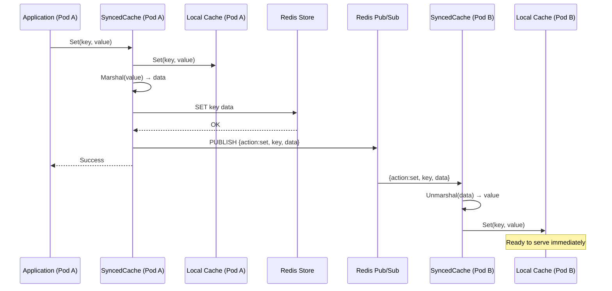
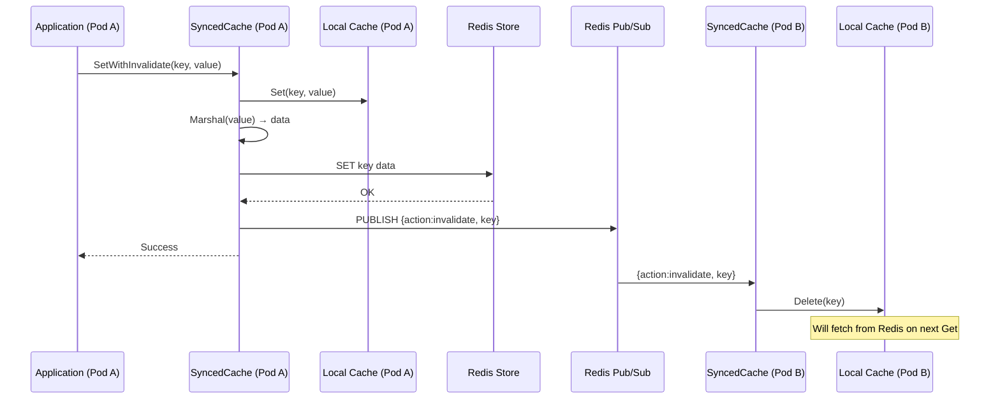
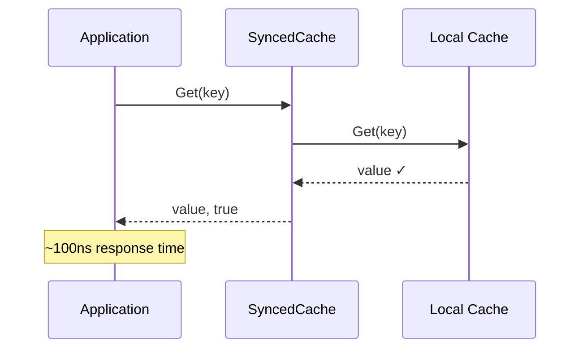
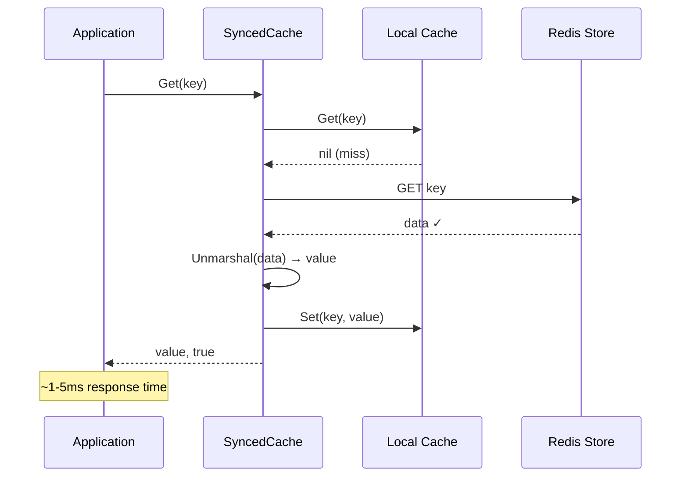
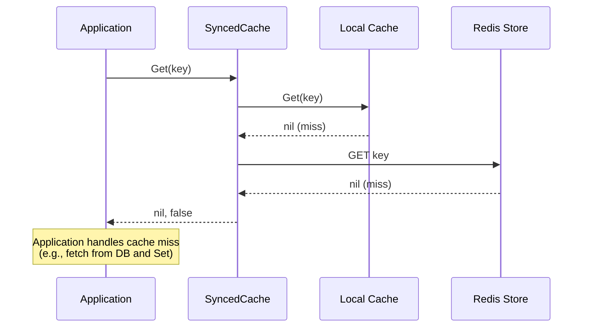
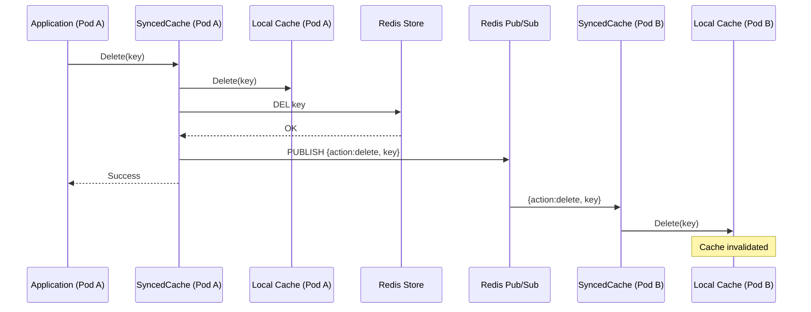
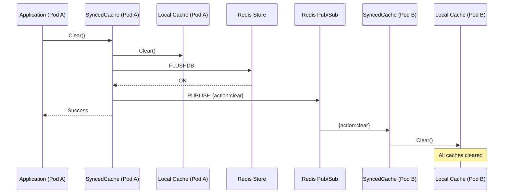

# Distributed Cache Library

[](https://github.com/huykn/distributed-cache/actions)
[](https://pkg.go.dev/github.com/huykn/distributed-cache?tab=doc)
[](https://github.com/huykn/distributed-cache?tab=readme-ov-file#license)
[](https://github.com/huykn/distributed-cache/stargazers)
[](https://github.com/huykn/distributed-cache/commits/main/)
[](https://goreportcard.com/report/github.com/huykn/distributed-cache)
[](https://codecov.io/github/huykn/distributed-cache)


A high-performance, distributed in-memory cache library for Go that synchronizes local LFU/LRU caches across multiple service instances using Redis as a backing store and pub/sub for set/invalidation events.

**Version**: v1.0.1

## Features

- **Two-Level Caching**: Fast local in-process LFU(Ristretto)/LRU(golang-lru) with Redis backing store (built-in) or custom your own implementation
- **Automatic Synchronization**: Redis Pub/Sub for cache set/invalidation across distributed services
- **High Performance**: LFU/LRU provides excellent hit ratios and throughput
- **Kubernetes Ready**: Designed for containerized environments with pod-aware invalidation
- **Simple API**: Easy-to-use interface for Get, Set, Delete, and Clear operations
- **Metrics**: Built-in statistics collection for monitoring cache performance
- **Flexible Configuration**: Environment variable support for easy deployment

## Architecture

The distributed-cache library uses a two-level caching architecture with local in-process caches synchronized via Redis pub/sub.

### 1. Set with Value Propagation

When a pod sets a value, it's stored locally and in Redis, then propagated to all other pods so they can update their local caches immediately without fetching from Redis.



### 2. Set with Invalidation Only

For large values or lazy loading scenarios, use `SetWithInvalidate()` - other pods only receive an invalidation event and will fetch from Redis when needed.



### 3. Get - Local Cache Hit

The fastest path: value is found in the local in-process cache (~100ns).



### 4. Get - Remote Cache Hit

Value not in local cache but found in Redis. Fetched and stored locally for future requests.



### 5. Get - Cache Miss

Value not found in either local cache or Redis.



### 6. Delete Operation

Removes value from local cache and Redis, then broadcasts deletion to all pods.



### 7. Clear Operation

Clears all values from local cache and Redis, then broadcasts clear event to all pods.



### Key Components

- **SyncedCache**: Main API providing Get, Set, Delete, Clear operations
- **Local Cache**: In-process cache build-in(LFU via Ristretto or LRU via golang-lru) or custom implementation
- **Redis Store**: Persistent backing store for cache data
- **Redis Pub/Sub**: Synchronization channel for cache invalidation and value propagation
- **Marshaller**: Pluggable serialization (JSON, MessagePack, Protobuf, etc.)
- **Logger**: Pluggable logging interface (Console, Zap, Slog, etc.)

### Data Flow

1. **Set Operation**: Value stored in local cache → Redis → Pub/sub event sent to other service instances (pods)
2. **Get Operation (Local Hit)**: Value retrieved from local cache (~100ns)
3. **Get Operation (Remote Hit)**: Value fetched from Redis → Stored in local cache (~1-5ms)
4. **Synchronization**: Other service instances (pods) receive pub/sub event → Update/invalidate local cache

## Installation

```bash
go get github.com/huykn/distributed-cache
```

## Quick Start

```go
package main

import (
	"context"
	"log"
	"time"

	"github.com/huykn/distributed-cache/cache"
)

func main() {
	// Create cache with default options
	opts := cache.DefaultOptions()
	opts.PodID = "pod-1"
	opts.RedisAddr = "localhost:6379"

	c, err := cache.New(opts)
	if err != nil {
		log.Fatal(err)
	}
	defer c.Close()

	ctx, cancel := context.WithTimeout(context.Background(), 5*time.Second)
	defer cancel()

	// Set a value
	if err := c.Set(ctx, "user:123", map[string]string{
		"name": "John Doe",
		"email": "john@example.com",
	}); err != nil {
		log.Fatal(err)
	}

	// Get a value
	value, found := c.Get(ctx, "user:123")
	if found {
		log.Printf("Found: %v", value)
	}

	// Delete a value
	if err := c.Delete(ctx, "user:123"); err != nil {
		log.Fatal(err)
	}

	// Get cache statistics
	stats := c.Stats()
	log.Printf("Stats: %+v", stats)
}
```

## Configuration

### Programmatic Configuration

```go
opts := cache.Options{
	PodID:                   "pod-1",
	RedisAddr:               "redis.default.svc.cluster.local:6379",
	RedisPassword:           "secret",
	RedisDB:                 0,
	InvalidationChannel:     "cache:invalidate",
	SerializationFormat:     "json",
	ContextTimeout:          5 * time.Second,
	EnableMetrics:           true,
	LocalCacheConfig: cache.LocalCacheConfig{
		NumCounters:        1e7,
		MaxCost:            1 << 30,
		BufferItems:        64,
		IgnoreInternalCost: false,
	},
}

c, err := cache.New(opts)
```

## API Reference

### Cache Interface

```go
type Cache interface {
	Get(ctx context.Context, key string) (any, bool)
	Set(ctx context.Context, key string, value any) error
	Delete(ctx context.Context, key string) error
	Clear(ctx context.Context) error
	Close() error
	Stats() Stats
}
```

## Performance Characteristics

- **Local Cache Hit**: ~100ns (in-process)
- **Remote Cache Hit**: ~1-5ms (Redis round-trip)
- **Cache Miss**: ~1-5ms (Redis lookup)
- **Set Operation**: ~1-5ms (Redis + Pub/Sub)

## Examples

The library includes comprehensive examples demonstrating various features and use cases:

### Getting Started

- **[Basic Example](examples/basic/)** - Core functionality, multi-pod synchronization, and value propagation
- **[Debug Mode](examples/debug-mode/)** - Detailed logging and troubleshooting techniques

### Cache Strategies

- **[LFU Cache](examples/lfu/)** - Least Frequently Used cache (default) for varying access patterns
- **[LRU Cache](examples/lru/)** - Least Recently Used cache for sequential access patterns
- **[LFU vs LRU Comparison](examples/comparison/)** - Side-by-side comparison to help choose the right strategy

### Customization

- **[Custom Logger](examples/custom-logger/)** - Integrate with Zap, Slog, Logrus, or custom logging systems
- **[Custom Marshaller](examples/custom-marshaller/)** - Use MessagePack, Protobuf, compression, or encryption
- **[Custom Local Cache](examples/custom-local-cache/)** - Implement custom eviction strategies and storage
- **[Custom Configuration](examples/custom-config/)** - Advanced tuning for production environments
- **[Kubernetes](examples/kubernetes/)** - Multi-pod scenario deployment

### Production Deployment

- **[Heavy-Read API](examples/heavy-read-api/)** - High-performance demo with 1M+ req/s, APISIX gateway, Prometheus/Grafana monitoring

Each example includes:
- Detailed README with explanation
- Runnable code demonstrating the feature
- Expected output and behavior
- Configuration options and best practices
- Troubleshooting tips

**Quick Start**: Begin with the [Basic Example](examples/basic/) to understand core concepts, then explore other examples based on your needs.

## Contributing

Contributions are welcome! Please see CONTRIBUTING.md for guidelines.

## License

MIT License - see LICENSE file for details.
