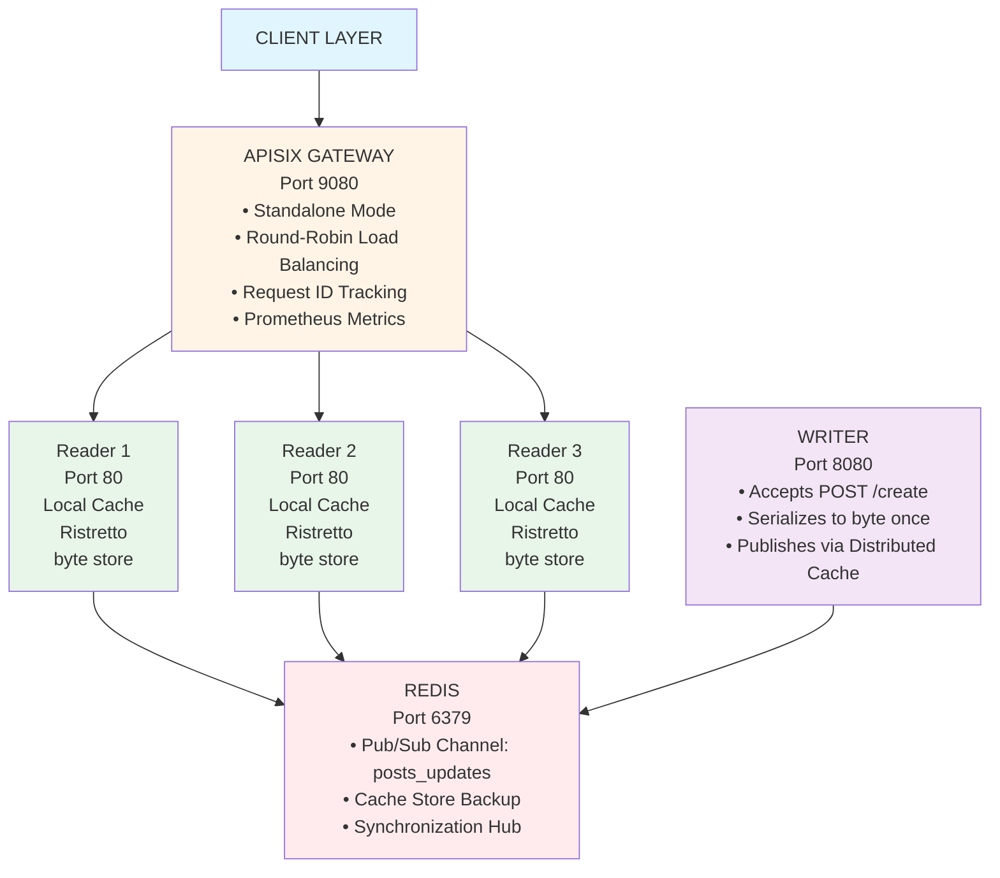

# Heavy-Read API Architecture

## Overview

This example demonstrates a production-ready architecture for handling heavy-read workloads with ultra-low latency. The system is designed to handle 1m+ requests per second with sub-millisecond read latency.

## Architecture Diagram



## Data Flow

### Write Path (POST /create)

1. **Client** sends POST request to Writer
2. **Writer** receives request and creates Post object
3. **Writer** serializes Post to `[]byte` (JSON) **once**
4. **Writer** calls `cache.Set(ctx, postID, postBytes)`
5. **Distributed Cache** stores in Redis
6. **Distributed Cache** publishes to Redis Pub/Sub channel
7. **All Readers** receive pub/sub event with serialized data
8. **Each Reader** stores `[]byte` directly in local cache
9. **Writer** returns success response

**Total Time**: ~10-50ms (including propagation to all readers)

### Read Path (GET /post?id=X)

1. **Client** sends GET request to APISIX Gateway
2. **APISIX** routes to one of the Reader instances (round-robin)
3. **Reader** checks local cache for postID
4. **Reader** retrieves `[]byte` from local cache (cache hit)
5. **Reader** writes bytes directly to HTTP response (zero-copy)
6. **Client** receives response

**Total Time**: ~0.5-2ms (P99)

### Cache Miss Path

1. **Reader** checks local cache → miss
2. **Reader** fetches from Redis
3. **Reader** deserializes to verify data
4. **Reader** stores in local cache
5. **Reader** returns to client

**Total Time**: ~5-10ms (rare, only on cold start)

## Key Optimizations

### 1. Zero-Serialization Read Path

**Traditional Approach:**
```
Redis → []byte → Unmarshal → Object → Marshal → []byte → HTTP Response
```

**Our Approach:**
```
Local Cache → []byte → HTTP Response
```

**Benefit**: 
- No CPU cycles wasted on serialization
- No garbage collection pressure
- Faster read latency

### 2. Pre-Propagation via Pub/Sub

**Traditional Approach:**
```
Write → Redis
Read → Check Local → Miss → Fetch Redis → Deserialize → Cache
```

**Our Approach:**
```
Write → Redis + Pub/Sub → All Readers Update Local Cache
Read → Check Local → Hit → Return
```
