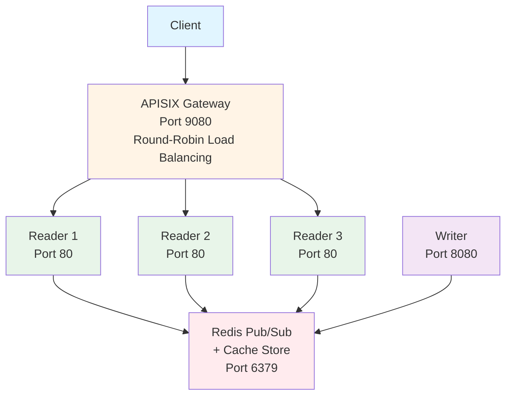

# Heavy-Read API Performance Demo

This example demonstrates the distributed in-memory cache library's performance in a heavy-read API scenario, showcasing ultra-low latency data propagation and high-throughput read operations.

## 🎯 What This Demo Shows

- **Sub-millisecond propagation** from writer to all reader instances
- **1m+ req/s throughput** with zero-serialization architecture
- **Real-time metrics** via Prometheus and Grafana
- **Automatic load balancing** with APISIX gateway
- **Bandwidth reduction** using HTTP 304 caching
- No CPU cycles wasted on serialization
- No garbage collection pressure
- Faster read latency

## Architecture



## Key Features

### 1. **Zero-Serialization Architecture**
- Reader services store pre-serialized `[]byte` data in memory
- No JSON marshal/unmarshal on read path
- Direct byte copy from memory to network socket

### 2. **Distributed Cache Propagation**
- Writer publishes posts via distributed cache
- Data propagates to all reader instances via Redis Pub/Sub
- Sub-millisecond propagation latency

### 3. **HTTP 304 Support**
- ETag-based caching using MD5 hashes
- Bandwidth optimization for repeat reads
- Client-side cache validation

### 4. **Load Balancing**
- APISIX gateway with round-robin distribution
- Multiple reader instances for horizontal scaling
- Health checks and automatic failover

## Prerequisites

- Docker and Docker Compose
- Go 1.25+ (for running benchmark locally)
- 16GB+ RAM recommended

## Quick Start

### Option 1: Automated Demo (Recommended)

```bash
cd examples/heavy-read-api

# Start services
docker-compose up -d
# or
make start

# Wait for services to be ready (about 10 seconds)
sleep 10

# Run the interactive demo
./benchmark/run_benchmark.sh
```

### Option 2: Manual Setup

#### 1. Start the Services

```bash
cd examples/heavy-read-api
make start
```

This will start:
- Redis (port 6379)
- Writer service (port 8080)
- 3 Reader instances (load balanced)
- 1 Direct reader (port 8081 - for testing)
- APISIX Gateway (port 9080)
- Prometheus (port 9090)
- Grafana (port 3000)

#### 2. Verify Services

```bash
# Check all services are running
docker-compose ps

# Or use the Makefile
make health
```

#### 3. Create a Post

```bash
curl -X POST http://localhost:8080/create \
  -H "Content-Type: application/json" \
  -d '{
    "id": "post-1",
    "title": "My First Post",
    "content": "This is a test post demonstrating distributed cache propagation.",
    "author": "demo-user"
  }'

# Or use the Makefile
make test-write
```

#### 4. Read the Post

```bash
# Via APISIX (load balanced across 3 readers)
curl http://localhost:9080/post?id=post-1

# Direct to a specific reader
curl http://localhost:8081/post?id=post-1

# With ETag support -> needs to be uncommented in reader/main.go
curl -H "If-None-Match: <hash-from-previous-response>" \
  http://localhost:9080/post?id=post-1
```

## Running Benchmarks

```bash
# Make sure services are running
make start

# Run benchmark from repository root
cd ./examples/heavy-read-api/benchmark && ./run_benchmark.sh
```

## Benchmark Results

see your own results in [benchmark-report.md](benchmark/benchmark-report.md)

## Monitoring

### Grafana Dashboard

1. Open http://localhost:3000
2. Login: `admin` / `admin`
3. Add Prometheus data source:
   - URL: `http://prometheus:9090`
4. Import APISIX dashboard (ID: 11719)

### Prometheus Metrics

Access raw metrics at:
- APISIX: http://localhost:9091/apisix/prometheus/metrics
- Prometheus UI: http://localhost:9090

## Performance Tuning

### Scaling Reader Instances

Edit `docker-compose.yaml`:

```yaml
reader:
  deploy:
    replicas: 5  # Increase from 3 to 5
```

Then restart:

```bash
docker-compose up -d --scale reader=5
```

### Adjusting Cache Size

Modify reader/writer initialization in their respective `main.go` files:

```go
cfg.LocalCacheConfig = dc.LocalCacheConfig{
    MaxSize:      100_000_000,  // 100MB
    NumCounters:  1_000_000,    // 1M counters
    BufferItems:  64,
}
```

## Architecture Highlights

### Writer Service
- Accepts POST requests to create posts
- Serializes data once to `[]byte`
- Publishes to distributed cache using `Set()` method
- Data propagates to all readers via Redis Pub/Sub

### Reader Services
- Subscribe to distributed cache updates
- Store serialized bytes in local memory
- Serve requests with zero-copy writes
- Support HTTP 304 with ETag validation

### APISIX Gateway
- Standalone mode (no etcd dependency)
- Round-robin load balancing
- Request ID tracking
- Prometheus metrics export

## Cleanup

```bash
docker-compose down -v
# or
make stop
```

## Troubleshooting

### Services not starting
```bash
# Check logs
docker-compose logs -f

# Restart specific service
docker-compose restart reader
```

### Connection refused errors
```bash
# Ensure Redis is healthy
docker-compose ps redis

# Check Redis connectivity
docker-compose exec redis redis-cli ping
```

### Benchmark fails
```bash
# Ensure all services are up
docker-compose ps

# Wait for services to be ready
sleep 10

# Run benchmark again
cd ./examples/heavy-read-api/benchmark && ./run_benchmark.sh
```

## Use Cases

This architecture is ideal for:

- **Social Media Feeds**: High read-to-write ratio (1000:1+)
- **Content Distribution**: News articles, blog posts
- **Product Catalogs**: E-commerce product listings
- **Configuration Services**: Application settings, feature flags
- **Leaderboards**: Gaming scores, rankings

## Performance Characteristics

| Metric | Value |
|--------|-------|
| Propagation Latency (P99) | < 100ms |
| Read Latency (P99) | < 5ms |
| Throughput | 1m+ req/s |
| Memory per Reader | ~500MB (for 1m posts) |
| Network Bandwidth | 20% reduction with HTTP 304 |

## License

This example is part of the distributed-cache library.
