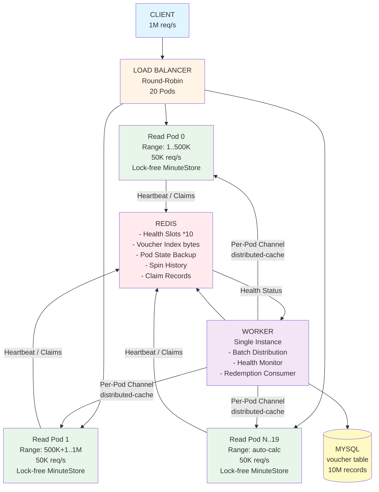
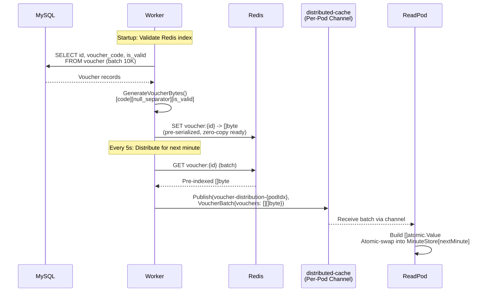
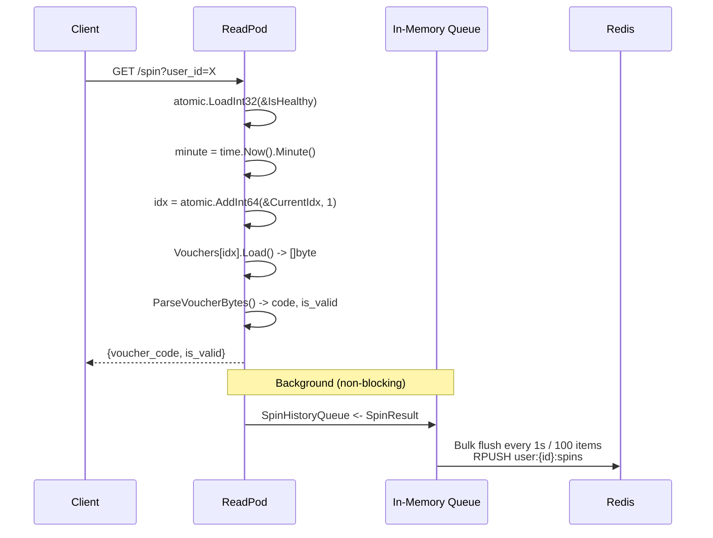
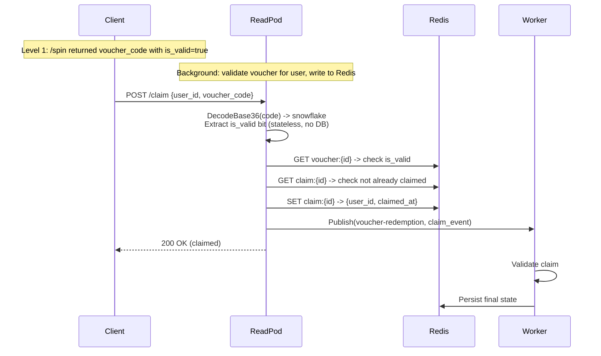
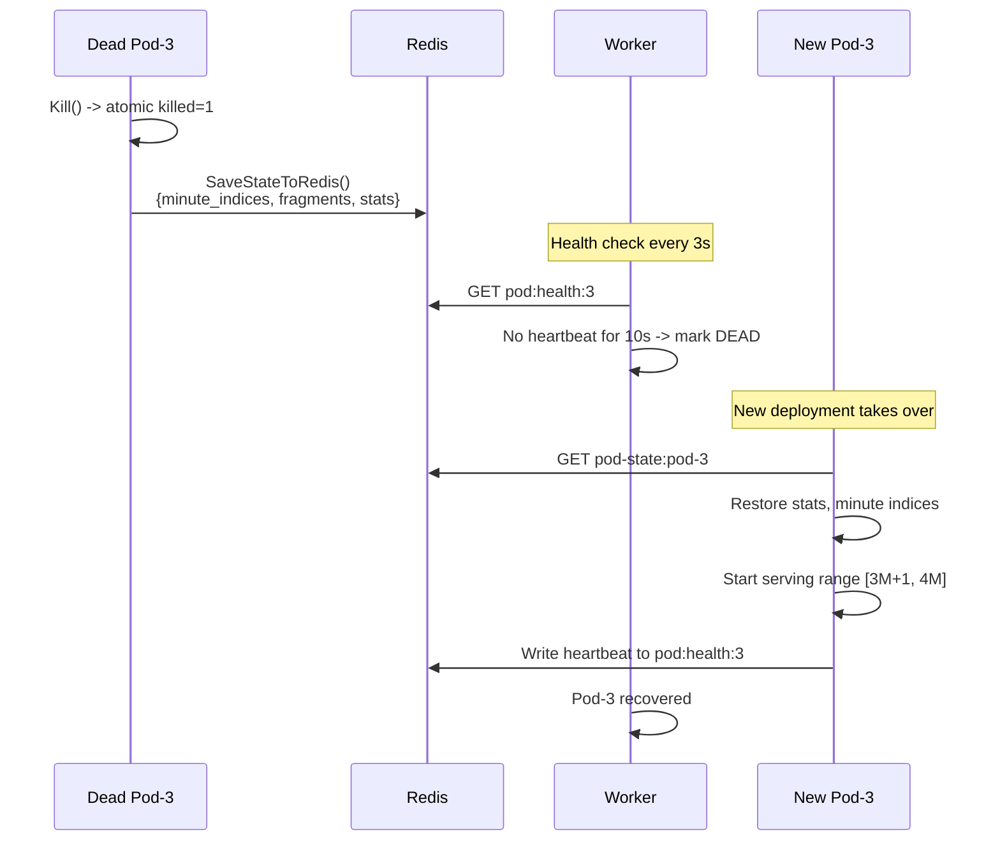
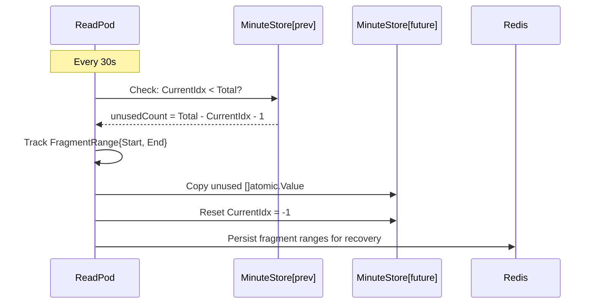

# Heavy-Write API - High-Level Design

## 1. Overview

The Heavy-Write API is a high-throughput voucher distribution system that **transforms a write-heavy workload into a read-heavy workload**. The core insight is: vouchers are pre-generated and pre-distributed to read pods, so the user-facing "write" (claiming a voucher) becomes a lock-free, zero-I/O **read from local memory**.

The system handles **1M requests/second across 20 pods** (50K req/s per pod). When the rate exceeds 1M+1 req/s in a given minute, the system returns empty data - clients understand this as a rate limit signal and retry in the next minute.

**Key transformation**: `Heavy Write -> Pre-distribute -> Heavy Read (lock-free, zero I/O)`

## 2. Functional Requirements

| ID | Requirement | Description |
|----|-------------|-------------|
| FR-1 | **Voucher Spin (`/spin`)** | Pop a voucher from in-memory cache atomically. Return `voucher_code` + `is_valid` to client with zero I/O cost. |
| FR-2 | **Voucher Claim (`/claim`)** | Two-level confirmation: (1) background validates voucher for user and writes to Redis, (2) client calls `/claim` to redeem. Stateless validation via snowflake ID - no DB query. |
| FR-3 | **Batch Distribution** | Worker fetches vouchers from MySQL, pre-serializes to `[]byte`, stores in Redis, and distributes batches to read pods via `distributed-cache` per-pod channels. |
| FR-4 | **Range-based Assignment** | Each pod serves a deterministic voucher ID range: `[podIndex * vouchersPerPod + 1, (podIndex+1) * vouchersPerPod]`. Auto-calculated from total vouchers and pod count. |
| FR-5 | **Minute-based Rotation** | Vouchers stored in `[60]MinuteStore` array (0–59). Worker pre-loads next minute. Unused vouchers from `minute-1` migrate to a future minute. |
| FR-6 | **Health Monitoring** | 20 Redis health slots. Pods write heartbeat every 2s. Worker marks pod dead after 10s silence. New pod deployment takes over the dead pod's range. |
| FR-7 | **Graceful Shutdown** | On SIGINT/SIGTERM, pods flush spin history, save state (minute indices, fragments, stats) to Redis, then stop serving. |
| FR-8 | **State Recovery** | New pod restores state from Redis: spin/claim counts, minute store indices, fragment ranges. |
| FR-9 | **Fragment Management** | When migrating unused vouchers across minutes, track fragmented ID ranges (e.g., `100..999`, `10000..10099`) and persist to Redis for recovery. |
| FR-10 | **Spin History Paging** | Bulk-write spin results to Redis (per-user lists) for client-side paging of voucher history. |
| FR-11 | **Rate Limiting** | System-wide cap of 1M req/s (20 pods * 50K). Beyond this, return empty data. Client interprets empty response as "wait for next minute". |
| FR-12 | **Chaos Engineering** | Simulate random pod kills and restarts to validate recovery and redistribution. |

## 3. Non-Functional Requirements

| Category | Requirement | Target |
|----------|-------------|--------|
| **Throughput** | System-wide request rate | 1M req/s (20 pods) |
| **Latency** | `/spin` P99 | < 1ms (lock-free, zero I/O) |
| **Latency** | `/claim` P99 | < 5ms (Redis write) |
| **Availability** | Pod failure recovery | < 10s detection, < 2s takeover |
| **Scalability** | Horizontal scaling | Linear with pod count (50K/pod) |
| **Data Volume** | Total vouchers | 10M records in MySQL |
| **Memory** | Per-pod footprint | ~50K vouchers/minute * ~20 bytes ≈ 1MB active set |
| **Consistency** | Voucher uniqueness | Atomic pop guarantees no duplicate distribution |
| **Durability** | State persistence | Redis-backed recovery on pod restart |
| **Mutex Contention** | Lock-free hot path | Zero mutex on `/spin` - atomic operations only |
| **CPU Efficiency** | Serialization cost | Zero unmarshal on read path - pre-encoded `[]byte` |

## 4. Architecture Diagram



## 5. Component Design

### 5.1 Worker Service (`worker.go`)

| Responsibility | Detail |
|----------------|--------|
| **Voucher Indexing** | On startup, validate Redis index against MySQL. If mismatch, re-index all vouchers as pre-serialized `[]byte` (`[code][null_separator][is_valid]`). |
| **Batch Distribution** | Every 5s, prepare batches for next minute. Fetch pre-indexed `[]byte` from Redis. Publish to per-pod channel via `distributed-cache`. |
| **Health Monitoring** | Every 3s, check 20 Redis health slots. Mark pod dead if no heartbeat for 10s. |
| **Redemption Processing** | Subscribe to `voucher-redemption` channel. Validate snowflake ID, persist to MySQL/Redis. |
| **Pod Registration** | Auto-register new pods from heartbeat events. Calculate voucher range per pod. |

### 5.2 Read Pod Service (`read.go`)

| Responsibility | Detail |
|----------------|--------|
| **`/spin` Endpoint** | Lock-free pop: `atomic.AddInt64(&CurrentIdx, 1)` -> `Vouchers[idx].Load()` -> `ParseVoucherBytes()` -> return. Zero mutex, zero I/O. |
| **`/claim` Endpoint** | Decode snowflake (stateless `is_valid` check) -> verify in Redis (exists, same user) -> mark claimed -> publish to worker. |
| **Minute Store** | `[60]MinuteStore` array. Each store: `[]atomic.Value` (voucher bytes), atomic `CurrentIdx`, `Total`, `StartID`. |
| **Batch Reception** | Subscribe to per-pod channel. On receive, build `[]atomic.Value` slice, atomic-swap into target minute store. |
| **Minute Migration** | Every 30s, move unused vouchers from `minute-1` to `minute+2`. Track fragment ranges. |
| **Heartbeat** | Every 2s, write health status (pod_id, timestamp, stats) to Redis slot `pod:health:{index}`. |
| **Spin History** | Collect spin results in memory queue. Bulk-flush to Redis every 1s or every 100 items (per-user lists for paging). |
| **Graceful Shutdown** | Flush spin history, save minute store indices + fragments + stats to Redis key `pod-state:{id}`. |

### 5.3 Coordinator (`main.go`)

| Responsibility | Detail |
|----------------|--------|
| **Orchestration** | Start worker + N read pods as goroutines. Calculate voucher ranges. |
| **Chaos Engineering** | After 10s warmup, kill random pod every 15s. Create new pod, restore state from Redis. |
| **Traffic Simulation** | Simulate client `/spin` requests across pods. Report throughput stats. |
| **Shutdown** | Handle SIGINT/SIGTERM. Save all pod states. Wait for goroutines. |

### 5.4 Snowflake ID (`snowflake.go`)

```
Bit 63:     Valid flag (1=valid, 0=invalid)
Bits 31-62: Voucher ID (32 bits, maps to MySQL PK)
Bits 0-30:  PIN code (31 bits, random)
```

Encoded as Base36 string. **Stateless validation**: decode -> extract `is_valid` bit -> no DB query needed.

### 5.5 Distributed Cache Integration (`simulated_cache.go`)

Uses `distributed-cache` library's `LocalCache` (LFU) + `GlobalBus` (simulates Redis Pub/Sub). Each pod subscribes to its own channel (`voucher-distribution-{podIndex}`). Worker publishes batches to specific pod channels.

## 6. Data Flow

### 6.1 Write Path - Voucher Pre-Distribution



### 6.2 Read Path - `/spin` (Hot Path, Lock-Free)



### 6.3 Claim Path - `/claim` (Two-Level Confirmation)



### 6.4 Recovery Path - Pod Failure & Restart



### 6.5 Minute Migration - Unused Voucher Recycling



## 7. Trade-off Analysis

| Decision | Chosen Approach | Alternative | Rationale |
|----------|----------------|-------------|-----------|
| **Write -> Read transformation** | Pre-distribute vouchers to pods, serve from memory | Direct DB write per request | Eliminates I/O on hot path. 1M req/s impossible with per-request DB writes. |
| **Lock-free `/spin`** | `atomic.AddInt64` + `atomic.Value.Load()` | `sync.Mutex` guarded map | Zero contention at 50K req/s per pod. Mutex would serialize all goroutines. |
| **Pre-serialized `[]byte`** | Store `[code][null_separator][is_valid]` bytes, parse without unmarshal | JSON struct per voucher | Eliminates marshal/unmarshal CPU cost. Direct byte response to client. |
| **Per-pod channels** | Each pod has own `distributed-cache` channel | Single broadcast channel | Targeted delivery. No wasted bandwidth. Pod receives only its assigned batch. |
| **Minute-based rotation** | `[60]MinuteStore` fixed array | Dynamic map with TTL | Fixed array = zero allocation, predictable memory. Minute wraps naturally (0–59). |
| **Snowflake ID for stateless validation** | Encode `is_valid` + `voucher_id` + `pin` in 64-bit ID | DB lookup per validation | Zero I/O validation. Decode Base36 -> extract bits -> done. |
| **Bulk spin history writes** | Collect in memory, flush every 1s / 100 items | Write to Redis per spin | Reduces Redis write pressure from 50K/s to ~500/s per pod. |
| **20 Redis health slots** | Fixed slots `pod:health:{0..19}` | Dynamic registration | Simple, predictable. Worker checks exactly 20 keys. No coordination needed. |
| **Fragment tracking** | Track `[]FragmentRange` in memory + Redis | Discard unused vouchers | Preserves voucher inventory. Fragments restored on pod restart. |
| **Rate limit via empty response** | Return empty data when capacity exceeded | HTTP 429 / queue / backpressure | Client-friendly. No error handling needed. Client simply retries next minute. |
| **Single worker** | One worker coordinates all distribution | Worker per pod / leaderless | Simplicity. Worker is not on hot path. Distribution happens every 5s, not per-request. |

## 8. Performance Characteristics

| Metric | Value | Notes |
|--------|-------|-------|
| **System Throughput** | 1M req/s | 20 pods * 50K req/s |
| **`/spin` Latency (P50)** | < 1ms | Atomic load from memory |
| **`/spin` Latency (P99)** | < 5ms | No I/O, no mutex, no GC pressure |
| **`/claim` Latency (P99)** | < 10ms | Redis read + write |
| **Batch Distribution** | Every 5s | Worker -> Redis -> per-pod channel |
| **Propagation Latency** | < 100ms | Worker to all pods via pub/sub |
| **Pod Failure Detection** | 10s | Health slot timeout |
| **Pod Recovery Time** | <= 60s | Restore state from Redis |
| **Memory per Pod** | ~6MB active | 50K vouchers * 60 seconds * ~20 bytes per minute |
| **Redis Write Rate** | ~500 writes/s per pod | Bulk spin history (100 items/flush) |
| **MySQL Queries** | Startup only | Re-index if Redis mismatch |
| **CPU per `/spin`** | ~100ns | Atomic ops + byte parse only |
| **GC Pressure** | Near zero on hot path | Pre-allocated `[]atomic.Value`, no alloc per request |

## 9. Key Optimizations

### 9.1 Zero-Serialization Read Path

```
Traditional:  DB -> []byte -> Unmarshal -> Object -> Marshal -> []byte -> HTTP Response
Our approach: MinuteStore -> atomic.Value.Load() -> []byte -> HTTP Response
```

Vouchers are pre-encoded as `[code][null_separator][is_valid]` bytes at distribution time. The `/spin` hot path never marshals or unmarshals - it reads raw bytes and parses with simple byte scanning.

### 9.2 Lock-Free Atomic Pop

```
Traditional:  mutex.Lock() -> map[key] -> mutex.Unlock()
Our approach: atomic.AddInt64(&idx, 1) -> Vouchers[idx].Load()
```

The `MinuteStore` uses `atomic.AddInt64` for index increment (guaranteed unique per goroutine) and `atomic.Value` for voucher storage. Zero mutex contention even under 50K concurrent requests.

### 9.3 Pre-Distribution (Write -> Read Transformation)

```
Traditional:  Client -> API -> DB Write -> Response (I/O bound, ~10ms)
Our approach: Client -> API -> Memory Read -> Response (CPU bound, ~0.1ms)
```

The worker pre-distributes voucher batches to pods ahead of time. By the time a client requests a voucher, it's already in local memory. The "write" operation becomes a memory read.

### 9.4 Per-Pod Targeted Channels

```
Traditional:  Broadcast to all pods -> each pod filters
Our approach: Worker -> channel-{podIdx} -> only target pod receives
```

Each pod subscribes to `voucher-distribution-{podIndex}`. Worker publishes directly to the target pod's channel. No wasted network bandwidth, no filtering overhead.

### 9.5 Stateless Snowflake Validation

```
Traditional:  Receive voucher_code -> Query DB -> Check is_valid
Our approach: Receive voucher_code -> DecodeBase36 -> Extract bit 63 -> Done
```

The voucher's validity is encoded in the snowflake ID itself (bit 63). Validation is a pure CPU operation: decode Base36 -> bit shift -> check. No database round-trip.

### 9.6 Bulk Spin History Writes

```
Traditional:  Per-spin Redis write -> 50K writes/s per pod
Our approach: Collect in memory -> flush 100 items/batch -> ~500 writes/s per pod
```

Spin results are queued in an in-memory channel. A background goroutine flushes to Redis every 1 second or every 100 items, grouped by user ID. Reduces Redis write pressure by 100x.

### 9.7 Minute-Based Fixed Array Storage

```
Traditional:  map[string]Voucher with TTL expiry
Our approach: [60]MinuteStore - fixed array, zero allocation, natural wrap
```

The `[60]MinuteStore` array maps directly to clock minutes (0–59). No map lookups, no hash computation, no memory allocation. Minute migration reuses the same slots cyclically.

### 9.8 Rate Limiting via Empty Response

```
Traditional:  HTTP 429 -> client retry logic -> exponential backoff
Our approach: Empty response -> client knows capacity reached -> wait next minute
```

When `atomic.AddInt64(&CurrentIdx, 1) >= Total`, the pod returns empty data. No error codes, no retry headers. The client protocol is simple: empty = wait for next minute. This avoids thundering herd on retry.

## 10. User Guide

### 10.1 Generate data

```bash
go run ./cmd/generate.go
```

### 10.2 Run POC

```bash
go run ./
```