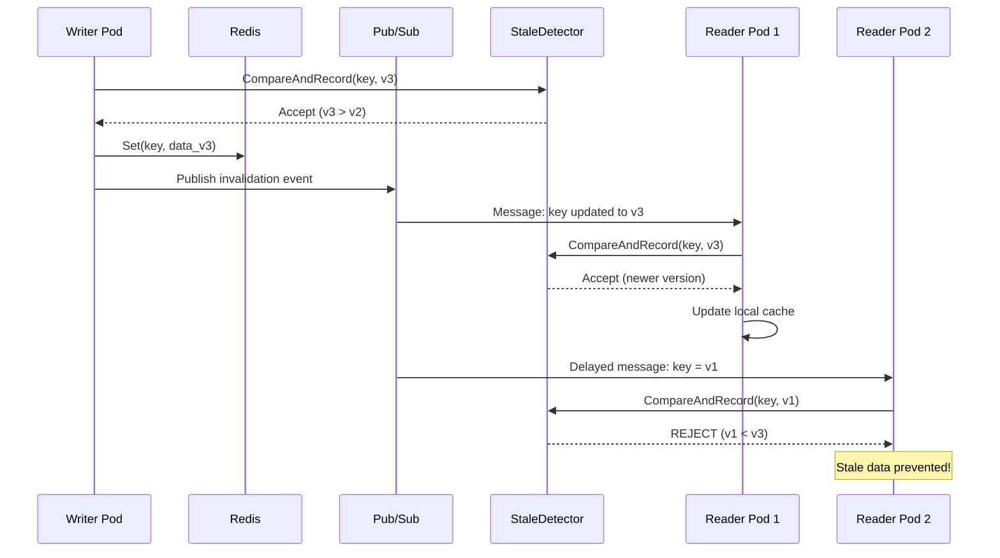
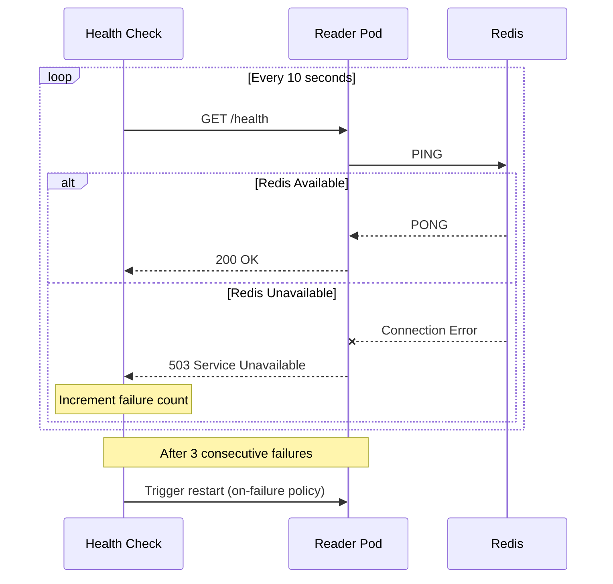

# Stale Data Prevention Example

## Introduction

### What is Stale Data Prevention?

In distributed caching systems, **stale data** occurs when cached entries contain outdated values that no longer reflect the current state in the source of truth (e.g., database or primary cache). This typically happens due to:

- **Out-of-order message delivery**: Pub/Sub messages arriving in different order than they were sent
- **Network partitions**: Temporary connectivity issues causing missed cache invalidation events
- **Race conditions**: Multiple concurrent writers updating the same key
- **Cache-aside pattern issues**: Local cache serving data while a newer version exists elsewhere

Stale data can lead to serious issues like displaying incorrect prices, serving outdated user sessions, or processing transactions with wrong inventory counts.

### Purpose of This Example

This example demonstrates a robust stale data prevention mechanism using:

1. **Versioned Data**: Each cache entry includes a version number and timestamp
2. **StaleDetector**: An atomic version tracker using compare-and-swap (CAS) operations
3. **CacheWrapper**: A wrapper that validates versions on both `Set()` and `Get()` operations
4. **OnSetLocalCache Hook**: Custom validation of pub/sub messages before storing in local cache

### Prerequisites

- Go 1.25+
- Redis server running on `localhost:6379`
- The `distributed-cache` library

## Architecture



## Test Scenarios

This example includes 6 comprehensive test scenarios that verify stale data prevention mechanisms:

### Test 1: Sequential Updates

**What it demonstrates**: Sequential cache updates propagating correctly with proper version ordering.

**Flow**:
1. Writer performs 3 sequential updates (v1 → v2 → v3) on key `test:sequential`
2. Each update is validated by `StaleDetector.CompareAndRecord()`
3. Updates are published via Redis Pub/Sub to reader pods
4. Reader receives and applies updates in order

**Expected Behavior**: Reader has version 3. Each version update is accepted because it's newer than the previous.

---

### Test 2: Stale Data Injection

**What it demonstrates**: Protection against malicious or accidental injection of stale data.

**Flow**:
1. Writer sets v5 on key `test:injection`
2. Reader waits for pub/sub propagation
3. Attempt to inject stale v2 data
4. `StaleDetector` rejects the stale v2

**Expected Behavior**: Stale v2 is rejected with reason "STALE". Reader maintains v5.

---

### Test 3: Out-of-Order Delivery

**What it demonstrates**: Protection against delayed/out-of-order message delivery in pub/sub systems.

**Flow**:
1. Writer rapidly sends v1, v2, v3, v4, v5 to key `test:outoforder`
2. All messages propagate normally
3. Simulate a delayed v2 message arriving after v5
4. `StaleDetector` rejects the stale v2 message

**Expected Behavior**: Delayed v2 is rejected. Final state is v5.

---

### Test 4: Cache-Aside Pattern

**What it demonstrates**: Detection and handling of stale data in local cache during cache-aside pattern operations.

**Flow**:
1. Writer sets v1 on key `test:cacheaside`
2. Reader caches v1 locally via pub/sub
3. Writer updates to v10 (large jump to make staleness obvious)
4. Pub/sub propagates v10 to reader
5. Reader performs `Get()` - validates against detector

**Expected Behavior**: Reader has latest version via pub/sub, or cache was invalidated if pub/sub was missed.

---

### Test 5: Concurrent Races

**What it demonstrates**: Handling of multiple concurrent writers racing to update the same key with out-of-order versions.

**Flow**:
1. 10 goroutines concurrently attempt to set versions [7, 3, 9, 1, 5, 10, 2, 8, 4, 6] on key `test:concurrent`
2. Each write attempt goes through `StaleDetector.CompareAndRecord()`
3. Only writes with higher versions than current are accepted
4. Lower version writes are rejected

**Expected Behavior**: Final version is v10 (the maximum). All lower versions are rejected.

---

### Test 6: Active Stale Detection on Get()

**What it demonstrates**: Active detection and invalidation of stale local cache during `Get()` operations.

**Flow**:
1. Reader manually caches stale v3 data (simulating missed pub/sub update)
2. Detector is updated to know v8 exists (simulating Redis truth)
3. Reader performs `Get()` which triggers version validation
4. Stale v3 is detected and local cache is invalidated

**Expected Behavior**: `Get()` detects stale cache and invalidates it, returning not found so that fresh data is fetched from Redis.

## Usage Guide

### Running the Example

```bash
# Ensure Redis is running
rdcli ping

# Run the example
cd examples/stale-data-prevention
go run main.go
```

### Sample Output

```
Stale Data Prevention - Verification Test

[TEST 1] Sequential Updates - Verify Correct Ordering
─────────────────────────────────────────────────────────
Step 1: Writer sets v1, v2, v3
  Writer -> v1
[INFO] demo: OK ACCEPTED newer version [key test:sequential v 1->2 source writer:set]
  Writer -> v2
[INFO] demo: OK ACCEPTED newer version [key test:sequential v 2->3 source writer:set]
  Writer -> v3

Step 2: Verify reader has v3
  Reader cache: v3
  Detector version: v3

[TEST 2] Stale Data Injection - Verify Rejection
─────────────────────────────────────────────────────────
Step 1: Writer sets v5
  Writer -> v5

Step 2: Try to inject stale v2
[WARN] demo: NG REJECTED stale data [key test:injection stale_v 2 current_v 5 source reader-1:set]
  OK Stale v2 REJECTED

Step 3: Verify reader still has v5
  Reader cache: v5 (current-v5)
  Detector version: v5
...

TEST SUMMARY
...
[4] OK PASS Cache-Aside Pattern
    Expected: v10
    Actual:   v10
    Info:     Reader should have latest version via pub/sub or detect staleness

[5] OK PASS Concurrent Races
    Expected: v10
    Actual:   v10
    Info:     Under concurrent updates, only highest version should win

[6] OK PASS Active Stale Detection
    Expected: invalidated (stale v3 removed)
    Actual:   invalidated
    Info:     Get() should actively detect and invalidate stale local cache

DETECTOR STATISTICS
  Total Checks:      60
  Fresh Accepts:     15 (new/newer versions)
  Stale Rejections:  12 (<-- THIS IS THE KEY METRIC)
  Duplicates:        33 (same version, not stale)

FINAL RESULT: 6/6 tests passed

OK Stale data prevention is VERIFIED
```

### Observing Stale Data Prevention

1. **Watch for "NG REJECTED stale data" logs**: These indicate the system successfully rejected outdated data
2. **Check DETECTOR STATISTICS**: Shows total checks, fresh accepts, stale rejections, and duplicates
3. **Review TEST SUMMARY**: Each test shows expected vs actual values and pass/fail status
4. **Monitor "Stale Rejections" count**: This is the key metric showing how many stale data attempts were prevented

### Configuration Options

| Option | Description | Default |
|--------|-------------|---------|
| `cfg.PodID` | Unique identifier for this cache instance | `"default-pod"` |
| `cfg.RedisAddr` | Redis server address | `"localhost:6379"` |
| `cfg.InvalidationChannel` | Pub/Sub channel for cache sync | `"cache:invalidate"` |
| `cfg.DebugMode` | Enable verbose logging | `false` |
| `cfg.ReaderCanSetToRedis` | Allow reader pods to write to Redis | `false` |
| `cfg.OnSetLocalCache` | Custom callback for validating pub/sub data | `nil` |

### Key Implementation Details

The `OnSetLocalCache` callback is the core of stale prevention:

```go
cfg.OnSetLocalCache = func(event dc.InvalidationEvent) any {
    var data VersionedData
    json.Unmarshal(event.Value, &data)

    // Atomic version check before storing
    shouldAccept, reason := detector.CompareAndRecord(
        data.Key, data.Version, data.Timestamp, podID+":pubsub")

    if !shouldAccept && reason == "STALE" {
        return nil // Reject stale data - don't store in local cache
    }
    return &data
}
```


## Edge Cases: Redis Connection Failures

### Edge Case 1: Redis Disconnection with Reader Pod

#### Behavior Overview

When a reader pod loses connection to Redis, the `distributed-cache` library behavior depends on the underlying `go-redis` client configuration:

1. **Initial Connection Failure**: If Redis is unavailable when creating the cache with `dc.New()`, the function returns an error immediately (fail-fast behavior).

2. **Runtime Disconnection**: During operation, Redis commands will fail with connection errors. The library:
   - Returns errors from `Get()`, `Set()`, `Delete()` operations
   - Calls the `OnError` callback if configured
   - Does NOT panic - errors are propagated to the caller

3. **Retry Behavior**: The underlying `go-redis` client has built-in retry with exponential backoff:

```go
// Default go-redis retry configuration:
// MaxRetries:      3 retries
// MinRetryBackoff: 8 milliseconds
// MaxRetryBackoff: 512 milliseconds
```

#### Configuring Connection Retry

The `distributed-cache` library uses the standard `go-redis` client which supports automatic retry:

```go
import "github.com/redis/go-redis/v9"

// For custom retry configuration, create Redis client directly
redisClient := redis.NewClient(&redis.Options{
    Addr:            "localhost:6379",
    MaxRetries:      5,                      // Retry up to 5 times
    MinRetryBackoff: 100 * time.Millisecond, // Start with 100ms backoff
    MaxRetryBackoff: 2 * time.Second,        // Max 2s between retries
    DialTimeout:     5 * time.Second,
    ReadTimeout:     3 * time.Second,
    WriteTimeout:    3 * time.Second,
})
```

#### Local Cache Behavior During Disconnection

When Redis is disconnected:

| Operation | Behavior |
|-----------|----------|
| `Get()` (cache hit) | Returns cached value from local cache |
| `Get()` (cache miss) | Returns error (cannot fetch from Redis) |
| `Set()` | Fails with error (cannot write to Redis) |
| Pub/Sub | Subscription channel closes, no invalidation events received |

**Important**: Local cache continues serving stale data during disconnection because pub/sub invalidation events are not received.

#### Reconnection Behavior

When Redis becomes available again:

1. **Pub/Sub**: Does NOT automatically reconnect. The subscription channel closes when Redis disconnects.
2. **Local Cache**: Remains unchanged - may contain stale data
3. **New Operations**: Will succeed once connection is restored
4. **Implement Health Checks**: Periodically verify Redis connectivity and restart the pod if it fails. Trade-off between availability and data consistency.
```go
maxFailures := 3
failureCount := 0
func checkRedisHealthOnFailure() {
    ctx, cancel := context.WithTimeout(context.Background(), 2*time.Second)
    defer cancel()
    if err := redisClient.Ping(ctx).Err(); err != nil {
        failureCount++
        if failureCount >= maxFailures {
            panic("Redis connectivity failed") // Restart the pod -> admit service unavailability
        }
    }
    failureCount = 0
}
```
5. **TTL on Cache Entries**: Use TTL on cache entries to limit the duration of stale data. Effect TTL means "You admit your data can be stale for at most TTL period.". Trade-off between data freshness and availability.

**Recommendation**: For production systems, implement a health check that restarts the pod when Redis connectivity is lost for extended periods.

---

### Edge Case 2: Redis Health Check with Auto-Restart

#### Docker Compose Example

```yaml
services:
  redis:
    image: redis:7-alpine
    ports:
      - "6379:6379"
    healthcheck:
      test: ["CMD", "redis-cli", "ping"]
      interval: 5s
      timeout: 3s
      retries: 3
      start_period: 5s
    restart: unless-stopped

  reader-pod:
    build: .
    depends_on:
      redis:
        condition: service_healthy
    environment:
      - REDIS_ADDR=redis:6379
      - POD_ID=reader-1
    healthcheck:
      test: ["CMD", "wget", "-q", "--spider", "http://localhost:8080/health"]
      interval: 10s
      timeout: 5s
      retries: 3
      start_period: 10s
    restart: on-failure:5
    deploy:
      restart_policy:
        condition: on-failure
        delay: 5s
        max_attempts: 5
        window: 120s

  writer-pod:
    build: .
    depends_on:
      redis:
        condition: service_healthy
    environment:
      - REDIS_ADDR=redis:6379
      - POD_ID=writer-1
      - WRITER_MODE=true
    healthcheck:
      test: ["CMD", "wget", "-q", "--spider", "http://localhost:8080/health"]
      interval: 10s
      timeout: 5s
      retries: 3
    restart: on-failure:5
```

#### Health Check Implementation

Implement a health endpoint that verifies Redis connectivity:

```go
func healthHandler(w http.ResponseWriter, r *http.Request) {
    ctx, cancel := context.WithTimeout(r.Context(), 2*time.Second)
    defer cancel()

    // Check Redis connectivity
    if err := redisClient.Ping(ctx).Err(); err != nil {
        w.WriteHeader(http.StatusServiceUnavailable)
        w.Write([]byte("Redis connection failed"))
        return
    }

    w.WriteHeader(http.StatusOK)
    w.Write([]byte("OK"))
}
```

#### How Health Check Detects Redis Unavailability



#### Restart Behavior and Recovery Process

1. **Detection** (10-30 seconds):
   - Health check runs every 10 seconds
   - After 3 consecutive failures (30 seconds), pod is marked unhealthy

2. **Restart** (5 seconds delay):
   - Docker/Kubernetes triggers pod restart
   - `restart: on-failure:5` allows up to 5 restart attempts

3. **Recovery**:
   - New pod instance starts
   - Waits for Redis health check (`depends_on: condition: service_healthy`)
   - Creates fresh cache instance with `dc.New()`
   - Subscribes to pub/sub channel
   - Local cache starts empty (cold cache)

4. **Cache Warm-up**:
   - First requests miss local cache, fetch from Redis
   - Pub/sub events populate local cache with updates from other pods


#### Best Practices for Production

1. **Separate Liveness and Readiness Probes**:
   - Liveness: Basic application health (restarts pod if fails)
   - Readiness: Redis connectivity (removes from load balancer if fails)

2. **Graceful Degradation**:
   - Continue serving cached data during short Redis outages
   - Log warnings but don't immediately fail

3. **Circuit Breaker Pattern**:
   - Avoid thundering herd when Redis recovers
   - Gradually restore connections

4. **Monitoring and Alerting**:
   - Track Redis connection errors
   - Alert on sustained disconnections
   - Monitor cache hit rates (sudden drops indicate issues)
