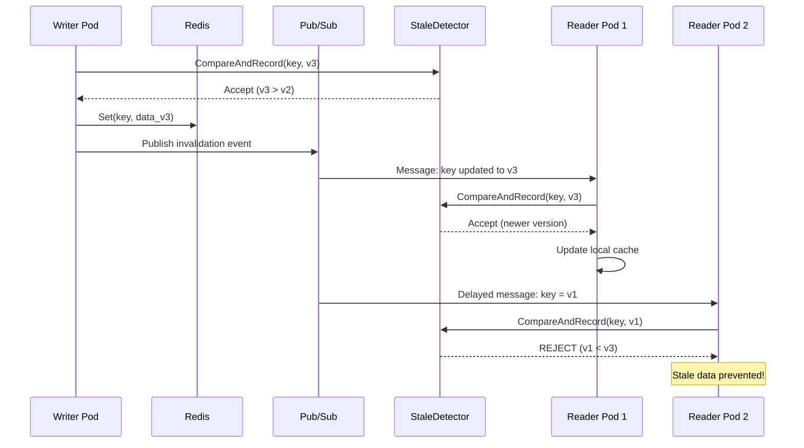

# Stale Data Prevention Example

## Introduction

### What is Stale Data Prevention?

In distributed caching systems, **stale data** occurs when cached entries contain outdated values that no longer reflect the current state in the source of truth (e.g., database or primary cache). This typically happens due to:

- **Out-of-order message delivery**: Pub/Sub messages arriving in different order than they were sent
- **Network partitions**: Temporary connectivity issues causing missed cache invalidation events
- **Race conditions**: Multiple concurrent writers updating the same key
- **Cache-aside pattern issues**: Local cache serving data while a newer version exists elsewhere

Stale data can lead to serious issues like displaying incorrect prices, serving outdated user sessions, or processing transactions with wrong inventory counts.

### Purpose of This Example

This example demonstrates a robust stale data prevention mechanism using:

1. **Versioned Data**: Each cache entry includes a version number and timestamp
2. **StaleDetector**: An atomic version tracker using compare-and-swap (CAS) operations
3. **CacheWrapper**: A wrapper that validates versions on both `Set()` and `Get()` operations
4. **OnSetLocalCache Hook**: Custom validation of pub/sub messages before storing in local cache

### Prerequisites

- Go 1.25+
- Redis server running on `localhost:6379`
- The `distributed-cache` library

## Architecture



## Scenarios

### Scenario 1: Normal Updates

**What it demonstrates**: Sequential cache updates propagating correctly across multiple reader pods.

**Flow**:
1. Writer performs 3 sequential updates (v1 → v2 → v3) on key `product:100`
2. Each update is validated by `StaleDetector.CompareAndRecord()`
3. Updates are published via Redis Pub/Sub to reader pods
4. Reader-1 and Reader-2 receive and apply updates in order

**Expected Behavior**: All pods end up with version 3. Each version update is accepted because it's newer than the previous.

---

### Scenario 2: Out-of-Order Pub/Sub Delivery

**What it demonstrates**: Protection against delayed/out-of-order message delivery in pub/sub systems.

**Flow**:
1. Writer rapidly sends v1, v2, v3 to key `order:200`
2. All messages propagate normally
3. A delayed v1 message arrives at the reader (simulating network delay)
4. `StaleDetector` rejects the stale v1 message

**Expected Behavior**: The delayed v1 message is rejected with log: `"STALE DATA REJECTED"`. Reader maintains v3.

---

### Scenario 3: Concurrent Racing Writers

**What it demonstrates**: Handling of multiple concurrent writers racing to update the same key.

**Flow**:
1. 10 goroutines concurrently attempt to set versions 1-10 on key `inventory:300`
2. Each write attempt goes through `StaleDetector.CompareAndRecord()`
3. Only writes with higher versions than current are accepted
4. Lower version writes are rejected

**Expected Behavior**: Only a subset of writes succeed (those that arrive when they're the newest). Summary shows accepted vs rejected counts.

---

### Scenario 4: Cache-Aside Stale Detection

**What it demonstrates**: Detection and invalidation of stale data in local cache when serving reads.

**Flow**:
1. Writer sets v1 on key `config:400`
2. Reader caches v1 locally
3. Writer updates to v3 (skipping v2)
4. Reader's local cache still has v1, but `StaleDetector` knows v3 exists
5. Reader performs `Get()` - the wrapper validates the cached version
6. Stale v1 is detected and local cache is invalidated

**Expected Behavior**: When reader calls `Get()`, the stale local cache is detected and invalidated, forcing a fresh fetch from Redis.

---

### Scenario 5: Stale Local Cache After Network Partition

**What it demonstrates**: Recovery from network partition where reader missed multiple updates.

**Flow**:
1. Writer sets v1 on key `session:500`, reader caches it
2. Network partition isolates the reader
3. Writer updates to v2, v3, v4 (reader doesn't receive pub/sub messages)
4. Partition heals
5. Reader attempts to read from local cache
6. `StaleDetector` (updated by writer) knows v4 is current
7. Reader's v1 is detected as stale

**Expected Behavior**: Reader detects its local cache is stale and either invalidates it or fetches the latest version from Redis.

## Usage Guide

### Running the Example

```bash
# Ensure Redis is running
redis-server

# Run the example
cd examples/stale-data-prevention
go run main.go
```

### Sample Output

```
=== Enhanced Stale Data Prevention Demo===
=== Scenario 1: Normal Updates ===
Writer performing sequential updates...
[INFO] demo: New key tracked [key product:100 version 1 source writer:set]
Writer: Set version 1
[WARN] demo: Pubsub message rejected [key product:100 message_version 1 current_version 1 pod reader-1]
[WARN] demo: Pubsub message rejected [key product:100 message_version 1 current_version 1 pod reader-2]
[INFO] demo: Version updated [key product:100 old_version 1 new_version 2 source writer:set]
Writer: Set version 2
[WARN] demo: Pubsub message rejected [key product:100 message_version 2 current_version 2 pod reader-1]
[WARN] demo: Pubsub message rejected [key product:100 message_version 2 current_version 2 pod reader-2]
[INFO] demo: Version updated [key product:100 old_version 2 new_version 3 source writer:set]
Writer: Set version 3
[WARN] demo: Pubsub message rejected [key product:100 message_version 3 current_version 3 pod reader-2]
[WARN] demo: Pubsub message rejected [key product:100 message_version 3 current_version 3 pod reader-1]

=== Scenario 2: Out-of-Order Pub/Sub Delivery ===
Testing out-of-order pub/sub message delivery...
  → Writer sending rapid updates (v1, v2, v3)...
[INFO] demo: New key tracked [key order:200 version 1 source writer:set]
[WARN] demo: Pubsub message rejected [key order:200 message_version 1 current_version 1 pod reader-2]
[WARN] demo: Pubsub message rejected [key order:200 message_version 1 current_version 1 pod reader-1]
[INFO] demo: Version updated [key order:200 old_version 1 new_version 2 source writer:set]
[WARN] demo: Pubsub message rejected [key order:200 message_version 2 current_version 2 pod reader-1]
[WARN] demo: Pubsub message rejected [key order:200 message_version 2 current_version 2 pod reader-2]
[INFO] demo: Version updated [key order:200 old_version 2 new_version 3 source writer:set]
[WARN] demo: Pubsub message rejected [key order:200 message_version 3 current_version 3 pod reader-1]
[WARN] demo: Pubsub message rejected [key order:200 message_version 3 current_version 3 pod reader-2]
  → Simulating delayed v1 message arriving after v3...
[WARN] demo: STALE DATA REJECTED [key order:200 stale_version 1 current_version 3 source reader-1:pubsub-delayed version_diff 2]
SUCCESS: Stale v1 rejected (current: v3)
...

=== Final Statistics ===
Total Version Checks: 53
Stale Data Rejected:  12
Success Rate:         77.36%

 -> Stale data prevention is working correctly!
```

### Observing Stale Data Prevention

1. **Watch for "STALE DATA REJECTED" logs**: These indicate the system successfully rejected outdated data
2. **Check Final Statistics**: Shows total checks, rejections, and success rate
3. **Monitor per-scenario output**: Each scenario prints whether stale data was accepted or rejected

### Configuration Options

| Option | Description | Default |
|--------|-------------|---------|
| `cfg.PodID` | Unique identifier for this cache instance | `"default-pod"` |
| `cfg.RedisAddr` | Redis server address | `"localhost:6379"` |
| `cfg.InvalidationChannel` | Pub/Sub channel for cache sync | `"cache:invalidate"` |
| `cfg.DebugMode` | Enable verbose logging | `false` |
| `cfg.ReaderCanSetToRedis` | Allow reader pods to write to Redis | `false` |
| `cfg.OnSetLocalCache` | Custom callback for validating pub/sub data | `nil` |

### Key Implementation Details

The `OnSetLocalCache` callback is the core of stale prevention:

```go
cfg.OnSetLocalCache = func(event dc.InvalidationEvent) any {
    var data VersionedData
    json.Unmarshal(event.Value, &data)
    
    // Atomic version check before storing
    shouldAccept, _, _ := detector.CompareAndRecord(
        data.Key, data.Version, data.Timestamp, podID+":pubsub")
    
    if !shouldAccept {
        return nil // Reject stale data - don't store in local cache
    }
    return &data
}
```
